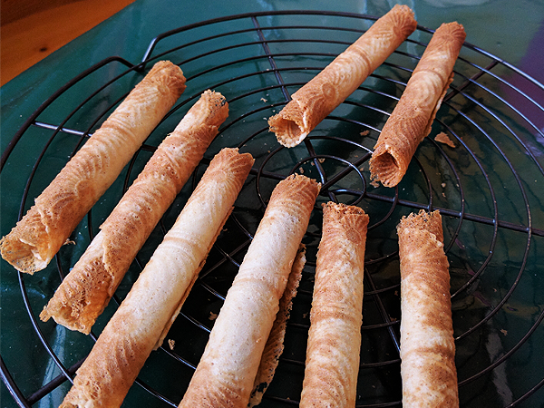
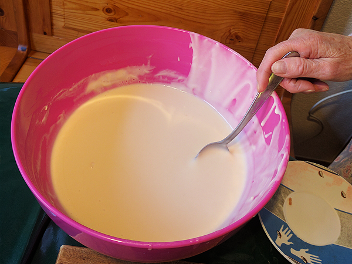
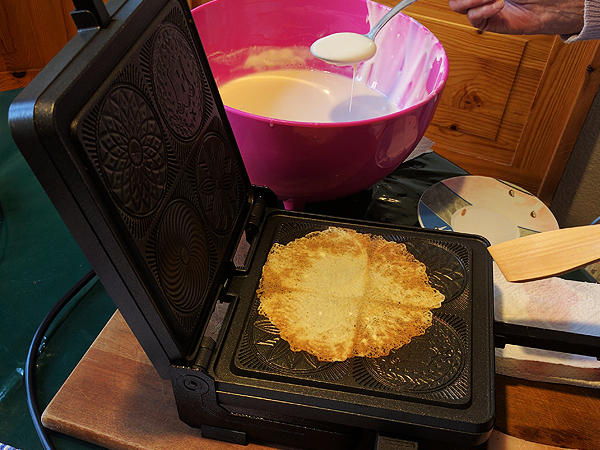
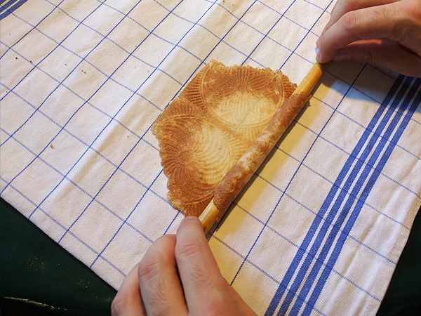
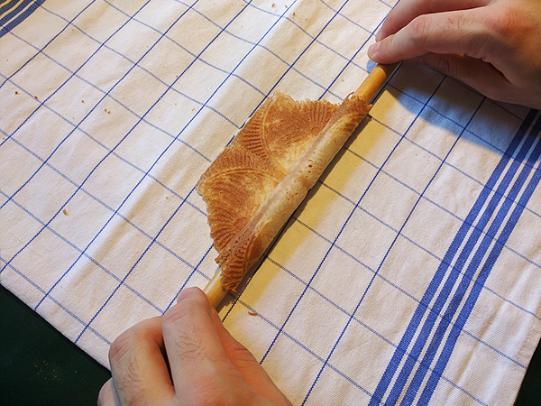
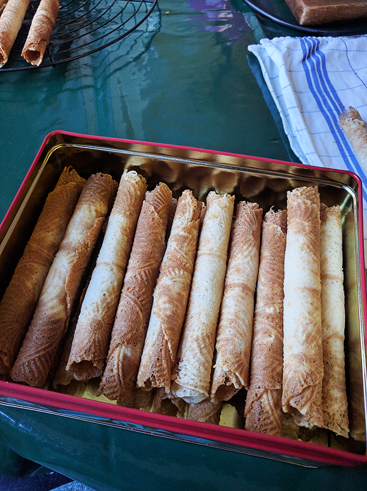

# Grämmus – Freiburger Bricelets Rezept

Feine Freiburger Bricelets nach Grämmus Rezept.

## Zubereitung Teig(Am Vorabend): 20min

Folgende Zutaten unter stetigem Rühren in eine Schüssel geben.
- 5 dl Greyerzer Doppelrahm
- 5 dl Wasser
- 350 g Zucker
- 500 g Mehl
- 2/3 Glas Weisswein
- 1 Prise Salz
- 100 g Butter flüssig

Teig über Nacht ruhen lassen.

## Backen

- Bricelet - Eisen vorheizen
- Mit Butter oder Speckschwarte einreiben, damit die Bricelets nicht am Eisen kleben bleiben.
- Einen Esslöffel voll Teig in die Mitte des Bricelet – Eisen geben.
- Bricelets für 20 Sekunden backen
- Anschliessend Bricelet vorsichtig rausnehmen und sofort auf einem vorbereitetem Tuch mit Hilfe eines Holzstabes in die korrekte Form rollen.

- Briceltes auf einem Gitterblech abkühlen lassen und anschliessend in einer Schachtel lagern.

**Tipp:** Für ein schokoladenes Erlebnis kann das Bricelet um ein Schoggistängeli gerollt werden.

**Haltbarkeit:**
 
In einer Büchse gut verschlossen ca. 8 Wochen

# Lizenz 

Dieses Werk ist lizenziert unter einer Creative Commons Namensnennung 4.0 International Lizenz.
